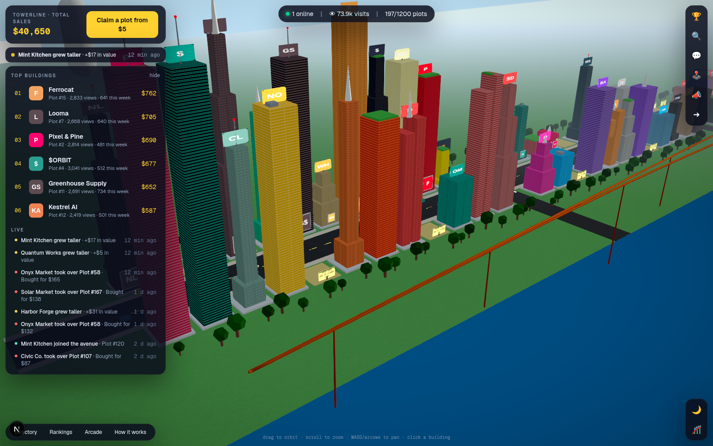

# Towerline

A living 3D city where brands, projects and creators own buildings. Every building is a
permanent public address on the avenue, with a logo, a link and **real analytics**:
impressions, unique visitors, views, clicks, CTR, referrers and conversions.

Built as a direct answer to Claim Avenue, with the mechanics people actually want from it
and the parts it is missing: owners get something measurable back, the economy has
recurring revenue, and there are reasons to come back every day.



## What's in the box

| Area | What you get |
| --- | --- |
| **3D city** | Three.js skyline: procedural facades (5 window styles), 5 shapes, roofs, logo boards, rooftop signs, trees, traffic, pedestrians, street lamps, day/night with bloom, a plaza, an arcade hall and a roller coaster. Click any building; hover for stats. |
| **Pay per floor** | Claim price is floors × $5. Height is value, value is the leaderboard. Zoning gives premium addresses minimum heights. The designer shows the leaderboard position you'd land at before you pay. 10-minute holds while someone checks out. |
| **Takeovers nobody loses on** | Any building sells for 1.25× value. The seller gets their value back plus 60% of the premium as instant credit, with a notification. Boosting raises both the price and the payout. |
| **Owner analytics** | Daily impressions (seen on skyline), uniques, views, clicks, CTR, period-over-period deltas, referrer breakdown, 7/30/90-day ranges, UTM-tagged outbound links, and a one-line **conversion pixel** so owners can see sales next to clicks. |
| **Plans (MRR)** | Owner (free), Pro $9, Landmark $49, billed every 30 days as real Stripe subscriptions (renewals, failed payments and cancellations handled by webhook; a sandbox subscription lifecycle for local dev). Longer history, referrers, height bonus, rooftop sign, takeover shield, featured placement. |
| **Billboards** | Self-serve block billboards ($20/wk) and an airship banner ($49/wk) with live seen / opens / clicks. |
| **Arcade & coins** | Soft currency earned by showing up (daily + streaks), exploring and referring; bought in packs; spent on three original games (Snake, Breakout, Runner) with daily and all-time leaderboards, and on the Skyline Coaster ride. 100 coins = $1 of building height, so playing grows your tower. |
| **Seasons** | Every week closes Monday 00:00 UTC: top 3 trending win coins and a featured spot on the home page, every rank is snapshotted so dashboards show "▲ 7 since last week", full history at `/seasons`. |
| **Emails** | Welcome with a 3-step checklist, "you were bought out" with the payout, "someone is eyeing your building" nudge, season results, and a Monday weekly report (views, clicks, CTR, rank movement; referrers for Pro). |
| **Growth loops** | Referral links (both sides get credit + coins), X share intents, OG share cards per building, an embeddable SVG badge, public plot pages for SEO. |
| **Community** | Avenue chat with anti-spam: only owners can post links, rate limits, duplicate suppression. Live feed over SSE: claims, takeovers, boosts, arcade records, billboards. |
| **Operator dashboard** | `/admin`: revenue by day and by product, MRR, ARPPU, visit→checkout→paid funnel, signups, outbound clicks delivered. |
| **Trust** | Transparent public stats, published rules and refund policy, instant edits, email receipts via Stripe, sandbox mode for demos. |

## Run it

```bash
cp .env.example .env.local      # defaults work out of the box (sandbox payments, console email)
npm install
npm run seed                    # ~200 demo buildings, 30 days of metrics, a feed
npm run dev                     # http://localhost:3000
```

Sign in with any email: without `RESEND_API_KEY` the magic link is printed to the server
console and returned in the sign-in response (dev mode). Checkout completes instantly in
sandbox mode (no `STRIPE_SECRET_KEY`).

Admin: put your email in `ADMIN_EMAILS` before signing in the first time.

## Production

- **Database**: libSQL. `DATABASE_URL=file:./data/towerline.db` locally; point it at a Turso
  URL + `DATABASE_AUTH_TOKEN` for production. Migrations in `drizzle/` run automatically on boot.
- **Payments**: set `STRIPE_SECRET_KEY` and `STRIPE_WEBHOOK_SECRET`; add a webhook for
  `checkout.session.completed` → `/api/stripe/webhook`. Seller payouts accrue as in-app credit;
  wire Stripe Connect when you want cash-out.
- **Email**: set `RESEND_API_KEY` and `EMAIL_FROM`.
- **Realtime**: SSE from an in-process bus. Fine on one instance (Fly, Railway, a VPS). For
  multi-instance, swap `src/lib/realtime.ts` for Redis pub/sub.
- **Cron**: two endpoints keep the economy honest. `/api/cron/daily` renews sandbox plans, expires
  lapsed ones, closes seasons and prunes dedupe rows; `/api/cron/weekly` (Monday) closes the season
  and sends digests. Protect them with `CRON_SECRET` (`?secret=` or a Bearer token). `vercel.json`
  schedules both on Vercel; anywhere else, hit them from any scheduler. Seasons also close lazily
  on the first request after the boundary, so nothing breaks without cron.
- Deploy on anything that runs Node 20+ (`npm run build && npm start`).

## Layout

```
src/lib/config.ts        prices, tiers, zoning, districts (all tunable)
src/lib/economy.ts       claims, takeovers, boosts, tiers, billboards, settle()
src/lib/arcade.ts        coins, games, prizes, coaster, coin→height conversion
src/lib/subscriptions.ts plan lifecycle: activate, renew, cancel, expire, MRR
src/lib/seasons.ts       weekly close, prizes, featured winners, rank snapshots
src/lib/emails.ts        welcome, sold, nudge, weekly digest
src/lib/analytics.ts     per-plot daily rollups, referrers, site KPIs
src/lib/auth.ts          magic links, sessions, referrals
src/lib/city/layout.ts   where every plot sits, height from value
src/components/city/     Three.js scene, HUD, panels (designer, plot, chat, arcade…)
src/app/                 pages + API routes
scripts/seed.ts          demo data
docs/STRATEGY.md         revenue, growth and engagement plan
```

## Scripts

`npm run dev` · `npm run build` · `npm start` · `npm run seed [-- --force]` ·
`npm run typecheck` · `npm run lint` · `npm run db:generate` (after schema changes)
