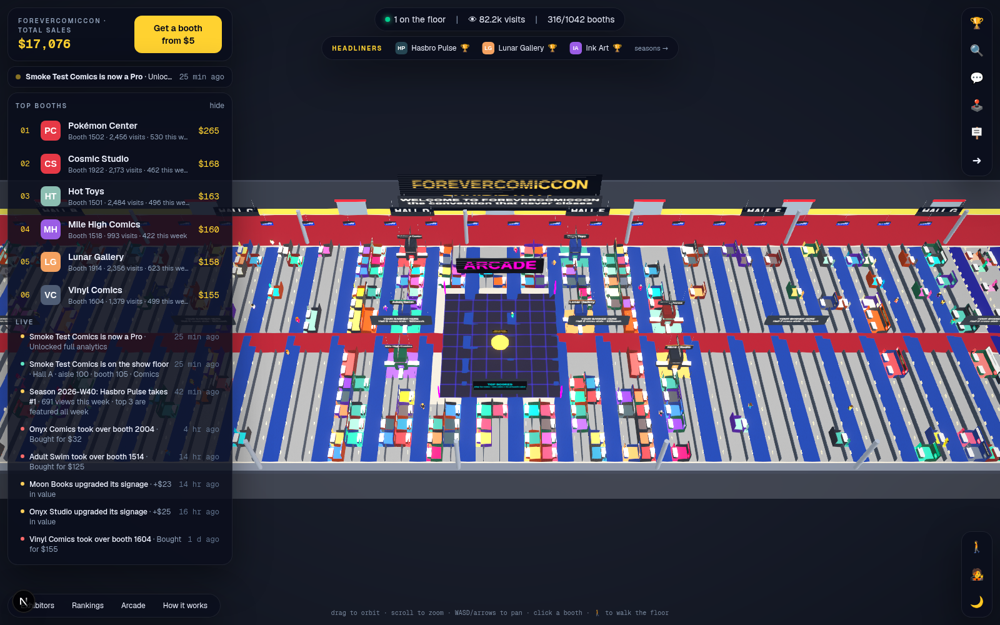
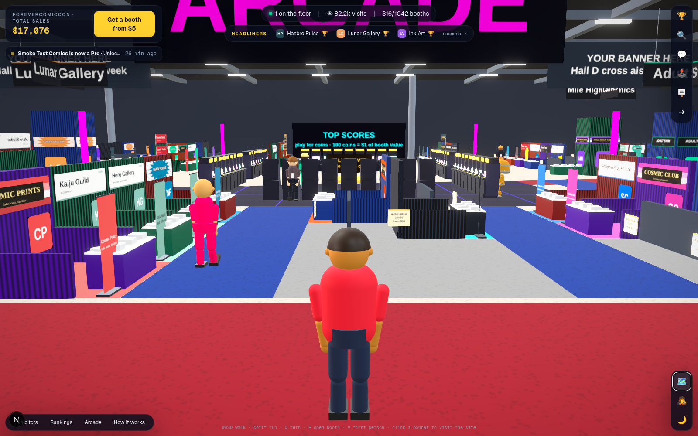

# ForeverComicCon

A 3D comic convention that never closes. Publishers, artists, shops and fan projects own
booths on a show floor laid out like San Diego's. Every booth is a permanent spot in the hall,
with a banner, a logo, a link and **real analytics**:
impressions, unique visitors, views, clicks, CTR, referrers and conversions.

Built as a direct answer to Claim Avenue, with the mechanics people actually want from it
and the parts it is missing: owners get something measurable back, the economy has
recurring revenue, and there are reasons to come back every day.





## What's in the box

| Area | What you get |
| --- | --- |
| **3D exhibit hall** | Three.js show floor: 34 numbered aisles, Halls A–H, a cross aisle, Artists' Alley at the east end, 1,000+ spaces, pipe-and-drape booths with banners in five styles, island towers, hanging signs that grow with value, truss lighting, entrance concourse, an arcade dead center, a wandering crowd, "after hours" lighting with bloom. Click any booth; click its banner to open the exhibitor's site in a new tab. |
| **Walk the floor** | Pick an avatar (body, skin tone, hair, outfit) and walk the hall in third or first person: WASD/arrows, run, collision with booths, a touch joystick on phones, "press E" at the nearest booth. Or stay on the map view and orbit. |
| **Booth sizes** | 6×10 Artists' Alley tables ($5), 10×10 inline ($10), 20×10 corners ($20), 20×20 islands ($50). Headliner Row around the arcade is 2×, front-of-house 1.5×. The claim picker is a real floor plan. 10-minute holds while someone checks out. |
| **Takeovers nobody loses on** | Any booth sells for 1.25× value. The seller gets their value back plus 60% of the premium as instant credit, with a notification. Boosting raises both the price and the payout, and the signage: tabletop → header banner → hanging sign → tower. |
| **Owner analytics** | Daily impressions (seen on the floor), uniques, visits, clicks, CTR, period-over-period deltas, referrer breakdown (banner, walk-up, map, rankings, directory, embed, X), 7/30/90-day ranges, UTM-tagged outbound links, and a one-line **conversion pixel** so exhibitors can see sales next to clicks. |
| **Plans (MRR)** | Owner (free), Pro $9, Landmark $49, billed every 30 days by charging the card saved with DivinityCoin (setup-mode checkout, renewals from the daily cron, failed charges mark the plan past due; a local simulator in test mode). Longer history, referrers, bigger signage, hanging sign, takeover shield, featured placement. |
| **Hanging banners** | It's indoors: self-serve cross-aisle banners per hall ($20/wk) and the entrance banner ($49/wk) with live seen / opens / clicks. |
| **Arcade & coins** | Soft currency earned by showing up (daily + streaks), exploring and referring; bought in packs; spent on three original games (Snake, Breakout, Runner) with daily and all-time leaderboards, and on the Hall Flyover drone ride. 100 coins = $1 of booth value, so playing grows your booth. |
| **Seasons** | Every week closes Monday 00:00 UTC: top 3 trending win coins and a featured spot on the home page, every rank is snapshotted so dashboards show "▲ 7 since last week", full history at `/seasons`. |
| **Emails** | Welcome with a 3-step checklist, "you were bought out" with the payout, "someone is eyeing your booth" nudge, season results, and a Monday weekly report (views, clicks, CTR, rank movement; referrers for Pro). |
| **Growth loops** | Referral links (both sides get credit + coins), X share intents, OG share cards per booth, an embeddable SVG badge, public booth pages for SEO. |
| **Community** | Hall chat with anti-spam: only exhibitors can post links, rate limits, duplicate suppression. Live feed over SSE: claims, takeovers, boosts, arcade records, billboards. |
| **Admin panel** | `/admin`: dashboard (revenue, MRR, pending checkouts, disputes, system checks), transactions with refunds and notes, booths (edit, hide, shield, feature, transfer, release), users (credit, coins, admin, sign-in links), plans (run renewals, charge, extend, comp, cancel), billboards moderation, a three-pane **mail inbox** (SendGrid Inbound Parse in, replies and drafts out, attachments, threads, keyboard shortcuts), versioned email templates with preview and test sends, email delivery logs, webhook deliveries with reprocess, an audit log, and a settings page for every API key. |
| **Trust** | Transparent public stats, published rules and refund policy, instant edits, email receipts, a DivinityCoin test mode for demos. |

## Run it

```bash
cp .env.example .env.local      # defaults work out of the box (DivinityCoin test mode, console email)
npm install
npm run seed                    # ~260 demo exhibitors, 30 days of metrics, a feed
npm run dev                     # http://localhost:3000
```

Sign in with any email: without `SENDGRID_API_KEY` the magic link is printed to the server
console and returned in the sign-in response (dev mode). With `DIVINITYCOIN_TEST_MODE=true` the
checkout frame loads a local simulator that posts a signed webhook to the site, so claims,
takeovers, plan setup, declines and refunds all run end to end without a DivinityCoin account.

Admin: put your email in `ADMIN_EMAILS` before signing in the first time, then manage keys at
`/admin/settings` (values in the database override `.env`).

## Production

- **Database**: libSQL. `DATABASE_URL=file:./data/forevercomiccon.db` locally; point it at a Turso
  URL + `DATABASE_AUTH_TOKEN` for production. Migrations in `drizzle/` run automatically on boot.
- **Payments (DivinityCoin only)**: in `/admin/settings → DivinityCoin` set the API URL, partner
  API key, partner slug and webhook secret, then register the webhook URL shown on
  `/admin/webhooks` (`/api/webhooks/divinitycoin`) in the DivinityCoin partner settings and turn
  test mode off. One-off purchases use hosted checkout (embedded in an iframe); plans save a card
  with a setup-mode checkout and are charged every 30 days. Refunds go back through the API from
  the transaction page. Seller payouts accrue as in-app credit.
- **Email (SendGrid)**: set the API key, from address and name under `/admin/settings → SendGrid`.
  Inbound mail: point a SendGrid Inbound Parse route at
  `/api/webhooks/sendgrid/inbound?key=<INBOUND_EMAIL_KEY>`. Delivery events (delivered, opened,
  bounced…): point the Event Webhook at `/api/webhooks/sendgrid/events?key=<SENDGRID_EVENT_KEY>`.
  Templates are seeded on first use and editable at `/admin/emails/templates`.
- **Realtime**: SSE from an in-process bus. Fine on one instance (Fly, Railway, a VPS). For
  multi-instance, swap `src/lib/realtime.ts` for Redis pub/sub.
- **Cron**: two endpoints keep the economy honest. `/api/cron/daily` charges plan renewals, expires
  lapsed ones, closes seasons and prunes dedupe rows; `/api/cron/weekly` (Monday) closes the season
  and sends digests. Protect them with `CRON_SECRET` (`?secret=` or a Bearer token). `vercel.json`
  schedules both on Vercel; anywhere else, hit them from any scheduler. Seasons also close lazily
  on the first request after the boundary, so nothing breaks without cron.
- Deploy on anything that runs Node 20+ (`npm run build && npm start`).

## Models

The 3D props and avatars are real `.glb` files in `public/models/`, listed in `manifest.json`.
The scene loads whatever the manifest lists and falls back to built-in primitives for anything
missing, so you can swap models one at a time.

- `npm run models` regenerates the procedural set (avatars with idle/walk/run clips, tables,
  chair, banner stand, arcade cabinet, truss light) from `src/lib/hall/modelkit/` through the
  dev page `/dev/models` (dev server must be running). Open that page to preview and download them.
- To replace one with your own model (Blender, an AI text-to-3D tool like Meshy or Tripo, a
  CC0 pack from Kenney or Quaternius), export a `.glb` with the same **node names** (avatars:
  `hips`, `torso`, `head`, `shoulder_l/r`, `forearm_l/r`, `thigh_l/r`, `shin_l/r`, `hair_*`) and
  **material names** (`skin`, `hair`, `shirt`, `pants`, `cloth`, `banner`, `screen`…), drop it in
  `public/models/`, and add it to `manifest.json`. Recoloring and animation pick it up by name.
- Avatars need three looping clips named `idle`, `walk` and `run`.
- `robot.glb` (the mascot) and `hdri/warehouse.hdr` (lighting) are CC0; see `public/models/LICENSES.md`.

## Layout

```
src/lib/config.ts        booth sizes, zones, tiers, categories (all tunable)
src/lib/economy.ts       claims, takeovers, boosts, tiers, billboards, settle()
src/lib/arcade.ts        coins, games, prizes, flyover, coin→value conversion
src/lib/subscriptions.ts plan lifecycle: activate, renew, cancel, expire, MRR
src/lib/seasons.ts       weekly close, prizes, featured winners, rank snapshots
src/lib/emails.ts        welcome, sold, nudge, weekly digest
src/lib/analytics.ts     per-booth daily rollups, referrers, site KPIs
src/lib/auth.ts          magic links, sessions, referrals, admin audit
src/lib/divinitycoin.ts  DivinityCoin partner API client + webhook signatures
src/lib/payments.ts      checkout sessions, confirm, refunds (DivinityCoin only)
src/lib/sendgrid.ts      SendGrid send + mail log, template rendering
src/lib/settings.ts      DB-backed settings with .env fallback (/admin/settings)
src/components/admin/    admin panel: dashboard, inbox, templates, users, transactions…
src/app/api/admin/       admin JSON routes (guarded by requireAdmin)
src/lib/hall/layout.ts   the floor plan: every space, its size, zone, hall, aisle and price
src/components/hall/     Three.js scene (Hall, Booth, EmptyBooths, Avatar, Arcade), HUD, panels, FloorPlan
src/app/                 pages + API routes
scripts/seed.ts          demo data
docs/STRATEGY.md         revenue, growth and engagement plan
```

## Scripts

`npm run dev` · `npm run build` · `npm start` · `npm run seed [-- --force]` ·
`npm run typecheck` · `npm run lint` · `npm run db:generate` (after schema changes)
